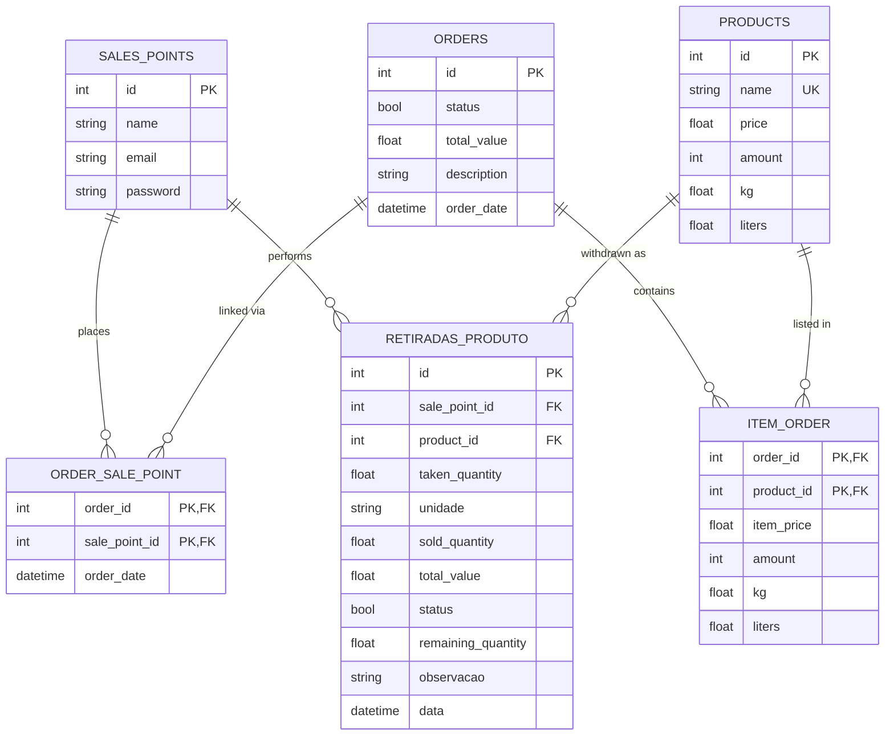

# Modelo de Domínio

Mapa das entidades, relacionamentos e schemas Pydantic. Fonte de verdade: `app/model.py`.

## Entidades (SQLAlchemy)

| Entidade | Tabela | PK | Colunas-chave | Constraints |
|---|---|---|---|---|
| **SalePoints** | `sales_points` | `id` (Int) | `name` (String 100), `email` (String 200), `password` (String 200) | — |
| **Order** | `orders` | `id` (Int) | `status` (Bool, default TRUE), `total_value` (Float), `order_date` (DateTime TZ), `description` (String 200) | — |
| **Product** | `products` | `id` (Int) | `name` (String 100, **UNIQUE**), `price` (Float), `amount` (Int), `kg` (Float), `liters` (Float) | — |
| **ItemsOrder** | `item_order` | (`order_id`, `product_id`) | `item_price` (Float), `amount`, `kg`, `liters` | FK orders/products (CASCADE) |
| **OrderSalePoint** | `order_sale_point` | (`order_id`, `sale_point_id`) | `order_date` (DateTime TZ, nullable) | FK orders/sales_points (CASCADE) |
| **RetiradaProduto** | `retiradas_produto` | `id` (Int) | `sale_point_id`, `product_id`, `taken_quantity` (Float), `unidade` (String 10), `sold_quantity` (Float), `total_value` (Float), `status` (Bool), `remaining_quantity` (Float), `observacao` (String 200), `data` (DateTime) | FK CASCADE; índices em `sale_point_id`, `product_id`, `data` |
| **Token** | `tokens` | `id` (String) | — | Blacklist de logout |

## Diagrama ER

## Schemas Pydantic

Padrão: separação `RequestDTO` (entrada) / `ResponseDTO` (saída) com `ConfigDict(from_attributes=True, populate_by_name=True)`.

| Domínio | Arquivo | DTOs |
|---|---|---|
| Order | `app/orders/order_schema.py` | `OrderRequestDTO`, `OrderResponseDTO`, `ItemOrderRequestDTO`, `ItemOrderResponseDTO` (alias `item_price` → `price`) |
| Product | `app/products/product_schema.py` | `ProductRequestDTO`, `ProductResponseDTO`, `ItemRetiradaDTO`, `ItemsRetiradaResponseDTO` (aliases `data` → `date`, `unidade` → `unit_type`) |
| SalePoint | `app/sales_points/sale_point_schema.py` | `SalePointRequestDTO`, `SalePointResponseDTO`, `OrderSalePointResponseDTO` |
| Outbound | `app/outbounds/outbound_schema.py` | `OutboundRequestDTO`, `OutboundResponseDTO` |

## Histórico de Migrations (Alembic)

Diretório: `alembic/versions/`

| # | Revision | Conteúdo |
|---|---|---|
| 1 | `4e1ae93cfaa8` | Tabelas iniciais: `orders`, `products`, `sales_points`, `tokens`, `item_order`, `order_sale_point` |
| 2 | `4c821097b713` | Recriar `tokens` com PK do tipo `String` |
| 3 | `c93f11f67c09` | Criar `retiradas_produto` + índices (sale_point_id, product_id, data) |
| 4 | `7ac942b3f282` | Adicionar `sold_quantity`, `total_value`; renomear `quantidade` → `taken_quantity` |
| 5 | `8845f91abf7b` | Adicionar `status` (Bool) e `remaining_quantity` (Float) em retiradas |
| 6 | `87d74ad32170` | Adicionar `order_date` (DateTime TZ) em `order_sale_point` |

## Domínio inferido

Sistema de **distribuição em consignação** de laticínios:

- **Sales Point** = ponto de venda (cliente B2B: mercearia, supermercado) com login próprio.
- **Product** = item do catálogo, suporta **três unidades de medida em paralelo** (`amount` / `kg` / `liters`) — cada produto pode ser comercializado em qualquer uma delas.
- **Order** = pedido agregado feito por um sales point. Liga a `ItemsOrder` (composição de produtos) e a `OrderSalePoint` (relação N:N com timestamp).
- **RetiradaProduto** (outbound) = **núcleo operacional**. Representa saída em consignação: o ponto de venda recebe X de produto (`taken_quantity`), vende Y (`sold_quantity`), o saldo vira `remaining_quantity`. Quando "retorna", reconcilia estoque.

**Fluxo típico:**
1. Sales point se autentica
2. Faz pedido (Order) com itens
3. Recebe produtos em consignação → cria RetiradaProduto
4. Vende durante o período → atualiza `sold_quantity` (`PATCH /outbounds/{id}/quantity`)
5. Reconcilia ao final → `PATCH /auth/{id}/outbounds` recalcula saldo restante
